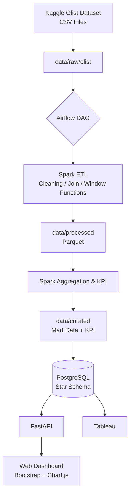
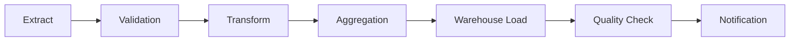
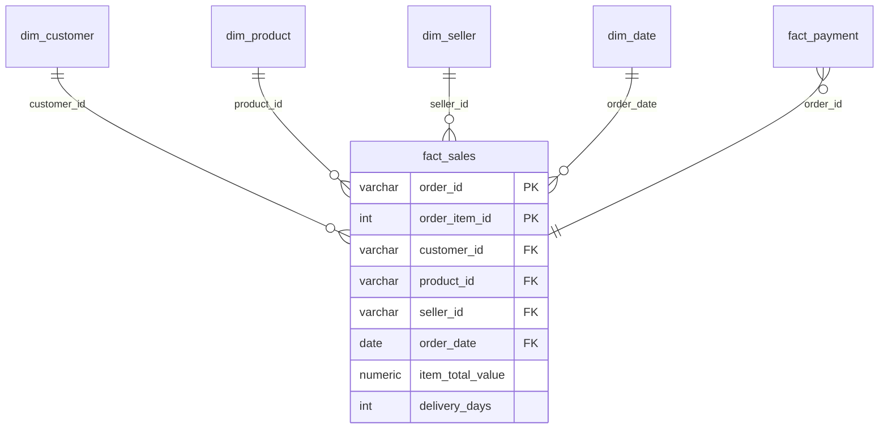
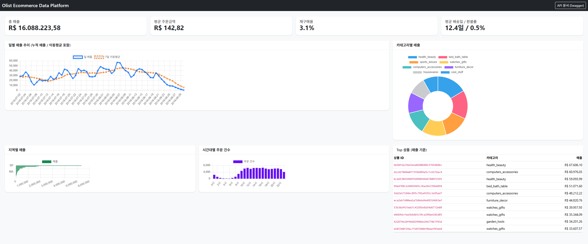
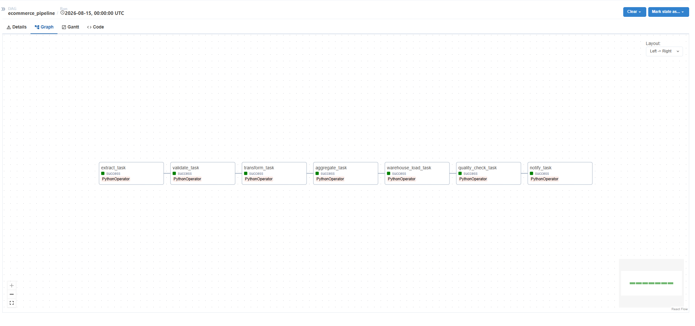
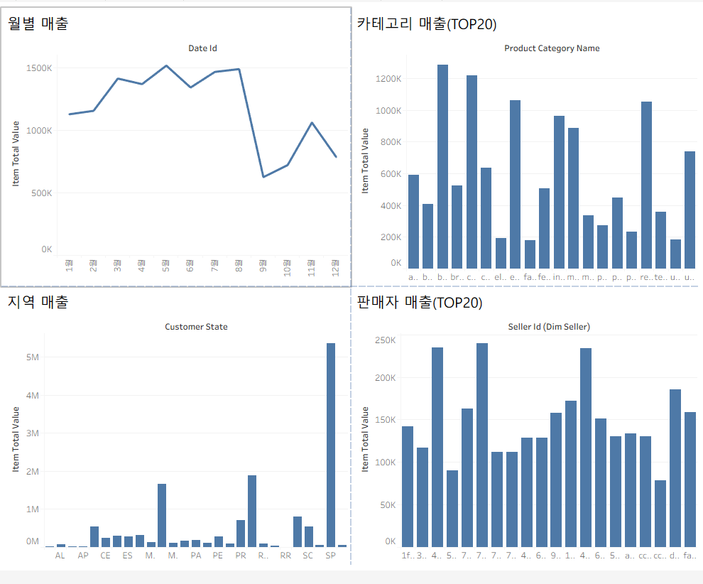

# Olist E-commerce Data Engineering Pipeline

Airflow + PySpark + PostgreSQL 기반 Batch Data Engineering Pipeline

Kaggle의 Brazilian E-Commerce Public Dataset(Olist)을 대상으로, 데이터 검증부터 PySpark 변환, PostgreSQL Star Schema 적재, 품질 재검증, FastAPI/Tableau serving까지 하나의 배치 파이프라인으로 구성한 프로젝트입니다. 오케스트레이션은 Airflow가 담당하고, 정제·집계는 PySpark, 분석용 저장소는 PostgreSQL 기반 Star Schema를 사용했습니다.

---

## 목차

1. [Architecture](#architecture)
2. [Airflow DAG](#airflow-dag)
3. [Data Warehouse (Star Schema)](#data-warehouse-star-schema)
4. [Incremental Order Ingestion](#incremental-order-ingestion)
5. [Engineering Highlights](#engineering-highlights)
6. [Tech Stack](#tech-stack)
7. [Testing & CI](#testing--ci)
8. [실행 방법 (Local)](#실행-방법-local)
9. [Azure 배포 (Production)](#azure-배포-production)
10. [결과](#결과)
11. [Engineering Decisions](#engineering-decisions)
12. [Known Limitations](#known-limitations)
13. [폴더 구조 / API / Tableau](#폴더-구조--api--tableau)

---

## Architecture



데이터는 원본 CSV → 검증 → Spark 정제/조립 → Parquet 중간 저장 → Spark 집계 → PostgreSQL Star Schema 적재 → API/BI 순으로 이동합니다.

---

## Airflow DAG

`ecommerce_pipeline` DAG(`dags/ecommerce_dag.py`)는 아래 7개 태스크로 순차 연결되어 있습니다.



| Task | 역할 |
|------|------|
| `extract_task` | 원본 CSV 존재 확인, 이전 배치 결과 아카이빙, API로 유입된 이벤트 병합 |
| `validate_task` | Null / 중복 / 스키마 / PK / FK 검증 (실패 시 여기서 중단) |
| `transform_task` | Spark로 정제 및 Star Schema용 fact/dim 조립 |
| `aggregate_task` | Window Function 기반 집계 마트 및 KPI 생성 |
| `warehouse_load_task` | PostgreSQL에 Upsert / mart 재적재 |
| `quality_check_task` | 적재 후 row count 및 null 재검증 |
| `notify_task` | 실행 결과 로그, `SLACK_WEBHOOK_URL` 설정 시 Slack 알림(선택) |

각 태스크는 `retries`(기본 2회), `retry_delay`(5분), `execution_timeout`(30분)을 개별적으로 가지며, 실패 시 `on_failure_callback`으로 공통 알림 로직(`notifier.py`)이 호출됩니다.

---

## Data Warehouse (Star Schema)



**`fact_sales`의 grain은 order item 1건 = 1 row**입니다. 주문 하나에 상품이 여러 개 있으면 `fact_sales`에도 그만큼 row가 생기고, PK는 `(order_id, order_item_id)` 복합키로 잡았습니다.

Dimension은 `dim_customer`, `dim_product`, `dim_seller`, `dim_date` 네 개고, 결제는 `fact_payment`로 별도 fact로 뒀습니다.

### fact_payment

결제는 `(order_id, payment_sequential)`을 유니크 키로 갖는 결제 이력이며,
분할 결제를 포함해 주문 단위로 여러 결제 이벤트가 발생할 수 있습니다.

`payment_value`라는 자체 measure를 가지며 `fact_sales`의 grain인
order item과 다른 grain을 가지므로, 결제 데이터를 별도의 fact table인
`fact_payment`으로 모델링했습니다. DDL, ETL upsert 로직, Tableau
데이터 소스 참조 모두 `fact_payment` 기준으로 일치시켰습니다.

---

## Incremental Order Ingestion

Kaggle 데이터셋은 고정된 정적 파일이라, 파이프라인만으로는 "새 데이터가 계속 들어오는" 흐름을 보여줄 수 없었습니다. 그래서 배치와 별개로 주문 이벤트를 하나씩 받는 API(`POST /ingest/orders`)를 추가했습니다.

```text
POST /ingest/orders (FastAPI)
        │  주문 이벤트를 data/raw/incremental/*.csv 에 스테이징
        ▼
extract_task (다음 배치 실행 시)
        │  스테이징된 이벤트를 원본 CSV에 병합 (PK 기준 dedup, 마지막 값 우선)
        ▼
이후 Validation → Transform → ... 은 기존 배치 흐름과 동일
```

API 컨테이너와 Airflow 컨테이너는 다른 이미지로 빌드되기 때문에 코드를 직접 import하지 않고, `data/` 디렉터리를 같은 Docker 볼륨으로 공유해서 파일로 데이터를 주고받습니다. 스테이징 파일이 없으면 `extract_task`는 기존과 동일하게 동작하므로, 이 기능이 정적 배치 흐름에 영향을 주지 않습니다.

**적용 범위는 정확히 ingestion layer까지입니다.** `spark_job.py`의 Transform/Aggregation 단계는 병합된 CSV 전체를 매 배치마다 다시 읽어서 처리하는 full-batch 구조이고, 여기에는 증분 처리가 적용되어 있지 않습니다. 처음에는 `order_date` 기준 `partitionBy`로 Parquet을 나눠 저장해서 이 부분까지 증분으로 가져가려 했는데, 재현이 잘 안 되는 인코딩 오류가 반복돼서 원인을 못 찾고 `coalesce(2)` 방식으로 되돌렸습니다. 그래서 지금은 ingestion은 증분, downstream은 full batch로 나뉘어 있고, 이건 약점이라기보다 현재 구현의 정확한 범위입니다.

요청 예시:

```bash
curl -X POST http://localhost:8000/ingest/orders \
  -H "Content-Type: application/json" \
  -d '{
    "customer_id": "9ef432eb6251297304e76186b10a928d",
    "items": [{"product_id": "4244733e06e7ecb4970a6e2683c13e61", "seller_id": "48436dade18ac8b2bce089ec2a041202", "price": 58.9, "freight_value": 13.29}],
    "payment": {"payment_type": "credit_card", "payment_installments": 2, "payment_value": 72.19}
  }'
```

---

## Engineering Highlights

**Data Quality — 3단계로 분리**
검증을 한 곳에 몰지 않고 세 지점에서 나눠서 확인합니다. ingestion 직후(`data_validation.py`)에는 스키마·Null 비율·PK·FK 무결성을, Spark 변환 단계(`spark_transformations.py`)에서는 가격 이상치를 IQR 기준으로 캡핑(삭제 대신 상한값으로 클리핑, 매출 총합 왜곡 방지)하는 처리를, 적재 이후(`quality_check.py`)에는 웨어하우스에 실제로 들어간 row 수와 핵심 키 컬럼의 null 여부를 재검증합니다. FK 위반은 완전히 막지 않고 비율이 10%를 넘을 때만 실패시키는데, 취소된 주문처럼 정상적으로도 소량 발생할 수 있는 사례를 무리하게 막지 않기 위해서입니다.

**Idempotency / Upsert**
같은 배치를 두 번 돌려도 중복이 쌓이지 않아야 해서, `fact_sales`와 dimension 테이블은 PK 기준 `INSERT ... ON CONFLICT DO UPDATE`로 적재합니다(`dw_loader.py`). 반면 `mart.*` 아래 집계 테이블은 "이번 배치 기준 전체 재계산" 값이라 이전 결과와 행 단위로 병합하는 게 의미가 없어서, 배치마다 `TRUNCATE` 후 통째로 재적재하도록 다르게 처리했습니다.

**Spark 처리 범위**
PySpark로 정제·조인·Window Function 기반 집계 파이프라인을 구성했지만, 로컬 Docker 환경에서 단일 노드로 실행되는 구조입니다. 대규모 분산 프로덕션 환경을 구현한 것은 아니고, 현재 데이터 규모(Olist 데이터셋 기준)에서 배치 처리 구조를 경험해보는 데 목적을 뒀습니다.

**Parquet 중간 저장**
Spark 변환 결과를 Parquet으로 저장해, 이후 집계 단계에서 CSV를 반복해서 읽지 않도록 했습니다. 날짜 기준 파티셔닝은 위에서 언급한 이유로 아직 적용하지 못했고, 데이터 규모가 크지 않은 지금은 성능 이슈가 없지만 더 큰 규모에서는 필요한 최적화입니다.

---

## Tech Stack

| Layer | Technology | 비고 |
|---|---|---|
| Orchestration | Apache Airflow 2.7 (LocalExecutor) | DAG 스케줄링, retry/timeout 설정 |
| Processing | PySpark | 로컬 Docker 환경에서 실행되는 batch 정제/집계 |
| Intermediate Storage | Parquet | Transform 산출물 저장 |
| Warehouse | PostgreSQL 13 | Star Schema |
| Serving API | FastAPI, SQLAlchemy | 웨어하우스 조회 + 증분 이벤트 수집 엔드포인트 |
| Web Dashboard | Jinja2, Bootstrap 5, Chart.js | FastAPI 위에서 렌더링 |
| BI | Tableau | PostgreSQL 라이브 연결 |
| Container | Docker, Docker Compose | postgres / airflow(webserver·scheduler·triggerer) / fastapi-dashboard |
| CI | GitHub Actions | flake8, pytest, Docker build |
| Testing | pytest | 45개 테스트 |

Airflow는 원래 CeleryExecutor + Redis 브로커 + 별도 worker 컨테이너로 구성했었는데, worker가 1개뿐이라 실질적인 수평 확장 없이 인프라만 복잡했습니다. 지금은 LocalExecutor로 단순화해서 redis 컨테이너와 airflow-worker 컨테이너를 없앴습니다. 나중에 worker를 여러 개로 늘릴 계획이 생기면 그때 다시 CeleryExecutor로 돌아가는 게 맞습니다.

---

## Testing & CI

```bash
pip install -r requirements.txt -r api/requirements.txt httpx
pytest tests -v
```

| 테스트 파일 | 검증 대상 | 개수 |
|---|---|---|
| `test_data_validation.py` | 스키마 / Null 비율 / PK / 복합키 | 6 |
| `test_dw_loader.py` | Upsert SQL 생성, `dim_date` 계산 | 7 |
| `test_quality_check.py` | 적재 후 품질 검사 실패 조건 (DB mock) | 4 |
| `test_incremental_ingest.py` | 이벤트 스테이징 → raw CSV 병합 → dedup | 9 |
| `test_api_ingest.py` | `POST /ingest/orders` 요청 검증 | 7 |
| `test_spark_aggregations.py` | 윈도우 함수(Lag/Running Total), 랭크 로직 | 6 |
| `test_spark_transformations.py` | 정제/조인/fact 조립 로직 | 6 |

총 45개, 로컬 기준 전부 통과합니다. DB나 Spark 클러스터가 실제로 붙어있지 않아도 되는 테스트(SQL 생성, 검증 로직, API 스키마)는 mock으로 분리했습니다. GitHub Actions(`ci.yml`)는 flake8 lint 이후 이 중 `test_api_ingest.py`(7개, FastAPI TestClient 기반이라 DB 연결 없이 돌아감)만 실행하고, 이어서 Airflow/FastAPI 두 이미지의 Docker build를 검증합니다. 나머지 38개(Spark, DB mock 포함)는 CI에 아직 올리지 않았고 로컬에서 `pytest tests -v`로 실행합니다.

---

## 실행 방법 (Local)

```bash
git clone <repository-url>
cd ecommerce-pipeline
cp .env.example .env
docker compose up -d --build
```

원본 CSV는 용량 문제로 레포에 포함하지 않았습니다(`.gitignore`로 `data/raw/*` 제외). [Kaggle에서 데이터셋](https://www.kaggle.com/datasets/olistbr/brazilian-ecommerce)을 받아 CSV 9개를 `data/raw/olist/`에 파일명 그대로 넣어야 합니다.

Airflow 웹 UI(`http://localhost:8080`, 기본 계정 `airflow`/`airflow`)에서 `ecommerce_pipeline` DAG를 Unpause 후 트리거하거나, CLI로:

```bash
docker compose exec airflow-webserver airflow dags unpause ecommerce_pipeline
docker compose exec airflow-webserver airflow dags trigger ecommerce_pipeline
```

실행이 끝나면 `http://localhost:8000/dashboard`(웹 대시보드), `http://localhost:8000/docs`(Swagger UI)에서 결과를 확인할 수 있습니다.

Spark 변환만 단독으로 돌려보려면:

```bash
cd dags
python -m scripts.data_validation
python -m scripts.spark_job
```

---

## Azure 배포 (Production)

로컬 Docker Compose는 Airflow/Spark 파이프라인과 FastAPI를 전부 포함하지만, 실제로 인터넷에 열어둔 것은 FastAPI 서빙 레이어뿐입니다. Airflow/Spark 배치는 지금은 로컬에서만 돕니다.

`master` 브랜치에 push되면 `.github/workflows/cd.yml`이 `api/` 폴더만 `azure/webapps-deploy@v3`로 Azure App Service(`ecommerce-fastapi-chris`, Linux, Python 3.11)에 배포합니다. Airflow 이미지나 저장소 전체가 아니라 API 서버 코드만 올라갑니다.

App Service의 `API_DB_URL`(또는 `DATABASE_URL`) 환경변수는 로컬 Docker의 `postgres:13` 컨테이너가 아니라 별도의 Azure Database for PostgreSQL(`ecommerce-pg-20260815`, PostgreSQL 16.14) 인스턴스를 가리킵니다. `api/database.py`가 이 값을 읽어 커넥션을 맺는 구조는 로컬/운영이 동일하고, 어느 DB에 붙을지만 환경변수로 갈립니다.

```text
Local           Docker Compose
                 └── PostgreSQL 13 (postgres 컨테이너)

Production       GitHub Actions (push to master)
                     └── Azure App Service (ecommerce-fastapi-chris)
                             └── Azure Database for PostgreSQL (ecommerce-pg-20260815)
```

Terraform이나 Bicep 같은 IaC는 레포에 없고, App Service/PostgreSQL 리소스 프로비저닝은 코드로 관리하지 않습니다. 실제 접속 정보는 App Service 환경변수로만 넣어뒀고 레포에는 값 없이 변수 이름만 남겨둡니다.

---

## 결과

캡처 기준 총 매출 R$ 16,088,223.58, 재구매율 3.1%, 평균 배송일과 환불률까지 포함한 KPI가 대시보드에 반영됩니다.



`extract_task`부터 `notify_task`까지 7개 태스크가 순서대로 실행되고 전부 성공(초록색)으로 끝난 Airflow Graph View입니다.



Tableau 워크북(`tableau/olist_dashboard.twb`)은 월별 매출, 카테고리별 매출(Top 20), 지역별 매출, 판매자별 매출(Top 20) 네 개 시트로 구성했습니다. 지역별 매출에서는 SP(상파울루)가 압도적으로 큽니다.



동일한 입력으로 파이프라인을 두 차례 실행해 중복 적재가 발생하지 않는 것도 확인했습니다.

---

## Engineering Decisions

**Why Airflow?**
단순 Python 스크립트를 cron으로 돌리는 대신 Airflow를 쓴 이유는 태스크 간 의존성, 재시도, 실패 알림, 실행 이력 추적이 파이프라인이 늘어날수록 스크립트 하나로는 관리가 안 되기 때문입니다. 태스크를 7단계로 쪼갠 것도 필요한 단계만 재실행할 수 있게 하려는 목적입니다.

**Why PySpark?**
pandas로도 처리 가능한 데이터 규모지만, 조인·Window Function·집계가 섞인 배치 변환 로직을 Spark 방식으로 구성하고 실행 구조를 경험해보는 것이 이 프로젝트의 목적 중 하나였습니다. Transform과 Aggregation을 별도 SparkSession/Task로 나눈 것도 Airflow 재시도 단위와 Spark 처리 단위를 맞추기 위해서입니다.

**Why Star Schema?**
단일 테이블에 모든 컬럼을 몰아넣는 이전 구조는 카테고리/판매자/고객 속성이 fact row마다 반복 저장되고, 갱신할 때마다 전체를 다시 써야 했습니다. Olist 데이터셋은 차원이 명확히 나뉘기 때문에 표준적인 Star Schema로 정리해서 분석 쿼리와 BI 연결이 쉬워지도록 했습니다.

**Why Upsert?**
같은 배치를 재실행했을 때 fact/dimension이 중복 적재되지 않아야 한다고 판단해서 PK 기준 upsert를 선택했습니다. 반면 mart 테이블은 매 배치가 전체 재계산 값이라 upsert가 아니라 truncate+insert로 처리했습니다.

**Why LocalExecutor (원래는 CeleryExecutor)?**
처음에는 실제 운영 환경처럼 보이려고 CeleryExecutor + Redis + 별도 worker 컨테이너로 구성했는데, worker가 1개뿐이니 수평 확장 이점 없이 인프라만 복잡해지는 구조였습니다. 지금 규모에서는 LocalExecutor가 더 맞는 선택이라 판단해서 바꿨고, worker를 늘려야 할 상황이 오면 그때 다시 CeleryExecutor로 돌아가면 됩니다.

**Why Incremental Ingestion (ingestion layer에 한정)?**
정적 데이터셋만으로는 파이프라인이 "계속 들어오는 데이터"를 처리한다는 그림이 나오지 않아서, 최소한 수집 계층에서라도 증분 처리를 보여주고 싶었습니다. downstream까지 증분으로 가져가는 건 Parquet 파티셔닝 문제를 해결한 이후로 미뤄뒀습니다.

---

## Known Limitations

- **downstream 증분 처리 미구현** — Transform/Aggregation은 현재 full-batch입니다. Parquet 파티셔닝 문제 해결이 선행 조건입니다.
- **날짜 기준 Parquet 파티셔닝 미해결** — `partitionBy` 시도 중 재현 어려운 오류로 `coalesce(2)`로 되돌린 상태입니다. 원인을 다시 조사해야 downstream 증분 처리도 진행할 수 있습니다.
- **Object Storage 미연동** — 지금은 로컬 파일시스템(`raw → processed → curated → archive`)만 사용하고, S3/Azure Blob 등 클라우드 오브젝트 스토리지 연동은 아직 없습니다.

---

## 폴더 구조 / API / Tableau

```text
ecommerce-pipeline/
├── dags/
│   ├── ecommerce_dag.py
│   ├── config/pipeline_config.py
│   └── scripts/
│       ├── extract.py, data_validation.py, spark_job.py
│       ├── spark_transformations.py, spark_aggregations.py
│       ├── dw_loader.py, quality_check.py, notifier.py
│       └── incremental_ingest.py, logging_utils.py
├── data/{raw,processed,curated,archive}/
├── api/                # main.py, database.py, schemas.py, incremental_ingest.py
├── sql/                # star_schema_ddl.sql, mart_views.sql
├── tableau/olist_dashboard.twb
├── tests/               # 45개 테스트
├── .github/workflows/ci.yml, cd.yml
├── images/              # README에 쓰인 스크린샷
├── config.yaml
├── .env.example
├── docker-compose.yml
└── requirements.txt
```

**API 주요 엔드포인트**: `/dashboard`, `/kpis`, `/sales/daily|monthly|category|region|hourly`, `/top-products`, `/sellers/ranking`, `/customers`, `/customer/{id}`, `/orders`, `POST /ingest/orders`. 전체 목록과 스키마는 `http://localhost:8000/docs`(Swagger UI)에서 직접 확인할 수 있습니다.

**Tableau**: [`tableau/olist_dashboard.twb`](./tableau/olist_dashboard.twb)를 다운로드하면 `fact_sales`를 소스로 만든 4개 시트를 직접 열어볼 수 있습니다. 워크북 없이 직접 대시보드를 구성하고 싶다면 `sql/mart_views.sql`의 View를 활용하면 됩니다.
